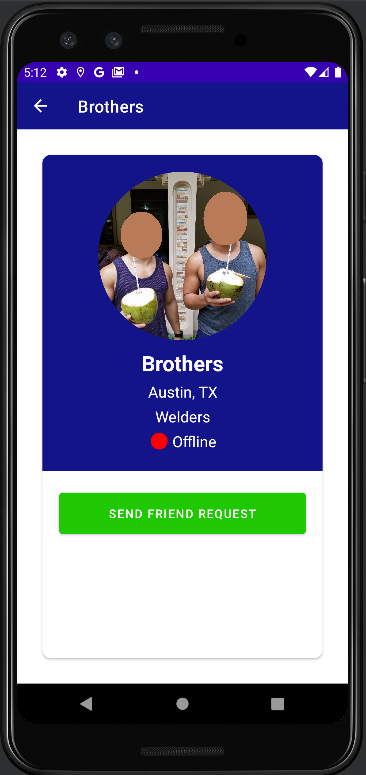

<p align="center">
  <a href="https://github.com/kuya32/SupApp">
    
  </a>

  <h3 align="center">Sup App</h3>

  <p align="center">
    Photo based social networking app including a chat feature.
  </p>
</p>

<details open="open">
  <summary>Table of Contents</summary>
  <ol>
    <li>
      <a href="#project-overview">Project Overview</a>
      <ul>
        <li><a href="#built-with">Built With</a></li>
      </ul>
    </li>
    <li>
      <a href="#getting-started">Getting Started</a>
    </li>
    <li><a href="#contributing">Contributing</a></li>
    <li><a href="#key-takeaways">Key Takeaways</a></li>
    <li><a href="#future-steps-to-improve-project">Future Steps to Improve Project</a></li>
    <li><a href="#license">License</a></li>
    <li><a href="#contact">Contact</a></li>
    <li><a href="#acknowledgements-and-credit">Acknowledgements and Credit</a></li>
  </ol>
</details>


## Project Overview


* User login page with "Forgot Password?" functionality


* User account sign up. User is then sent a email to verify their account.


* User can construct a photo post which is then shared into the main feed recycler view.


* Side pull out menu drawer showcases different features of the app.



* The user can find other accounts and send friend requests.


* Once friends, they can chat and mingle with other account users.


### Built With

* [Google Firebase](https://firebase.google.com/)
* [Android Image Cropper](https://github.com/ArthurHub/Android-Image-Cropper)
* [Picasso](https://github.com/square/picasso)


## Getting Started

### Installation

1. Create an account and get a Google Firebase console API key at [Google Firebase](https://firebase.google.com/)
2. Clone the repo
   ```sh
   git clone git@github.com:kuya32/SupApp.git
   ```
3. Install NPM packages
   ```sh
   npm install
   ```


## Contributing

Contributions are what make the open source community such an amazing place to be learn, inspire, and create. Any contributions you make are **greatly appreciated**.

1. Fork the Project
2. Create your Feature Branch (`git checkout -b feature/AmazingFeature`)
3. Commit your Changes (`git commit -m 'Add some AmazingFeature'`)
4. Push to the Branch (`git push origin feature/AmazingFeature`)
5. Open a Pull Request

## Key Takeaways

1. I got to learn how to use Google Firebase authentication, cloud firestore, realtime database, storage and cloud messaging.
2. I got to learn how to store data and retrieve data from the firebase database.
3. I got to learn how to create a chat room with another user.
4. I learned how to utilize libraries such as the photo crop and picasso libraries.
5. I learned how to use a search view within the toolbar to add more functionality to the app.
6. I learned how to incorporate a side menu drawer to the project which makes the app more professional.
7. Through I did not successfully incorporate notifications to the project, I got to learn about sending and retrieving notifications.
8. I learned how to make a splash activity.

## Future Steps to Improve Project

* I got stuck on how to incorporate notifications and using Google Firebase's cloud messaging system. I want to be able to send notifications to the user when another user messages them or the user gets a new friend request.
* I want to learn how to use pagination for my recycler views and be able to grab information for the database with custom requirements.
* When choosing a profile image to crop, there seems to be multiple intents happening to the users photo gallery. Need to fix this small bug.
* Recycler views should show the latest messages in the chat activity. Currently the user would need to scroll down to see the latest messages within the chat.
* When the user updates their profile image/information, I want this update to affect throughout the app such as previous comments
* Currently the transitions through multiple intents slows down the app because the main thread is being overloaded. I could find a way to make the transition more efficient and fluent.
* Sharing feature for user's posts

## License

Distributed under the MIT License. See `LICENSE` for more information.


## Contact

Marchael Acode - [LinkedIn](https://www.linkedin.com/in/marchaelacode/) - m.acode@outlook.com - kuya3232@gmail.com

Project Link: [Sup App](https://github.com/kuya32/SupApp)


## Acknowledgements and Credit
* [Chat Me App Video Tutorial - 44 Videos](https://www.youtube.com/c/technicalskillz/videos)
* [Android Image Cropper](https://github.com/ArthurHub/Android-Image-Cropper)
* [Converting Image URL to Bitmap](https://thinkandroid.wordpress.com/2009/12/25/converting-image-url-to-bitmap/)
* [Save Bitmap to a Location](https://stackoverflow.com/questions/649154/save-bitmap-to-location)
* [Picasso](https://github.com/square/picasso)
* [Send a User Verification Email](https://www.youtube.com/watch?v=06YKlMdWyMM)
